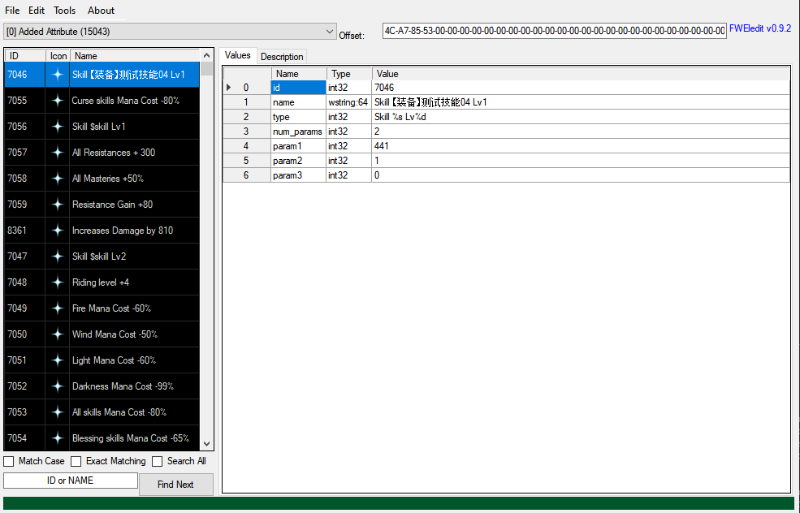
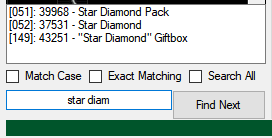
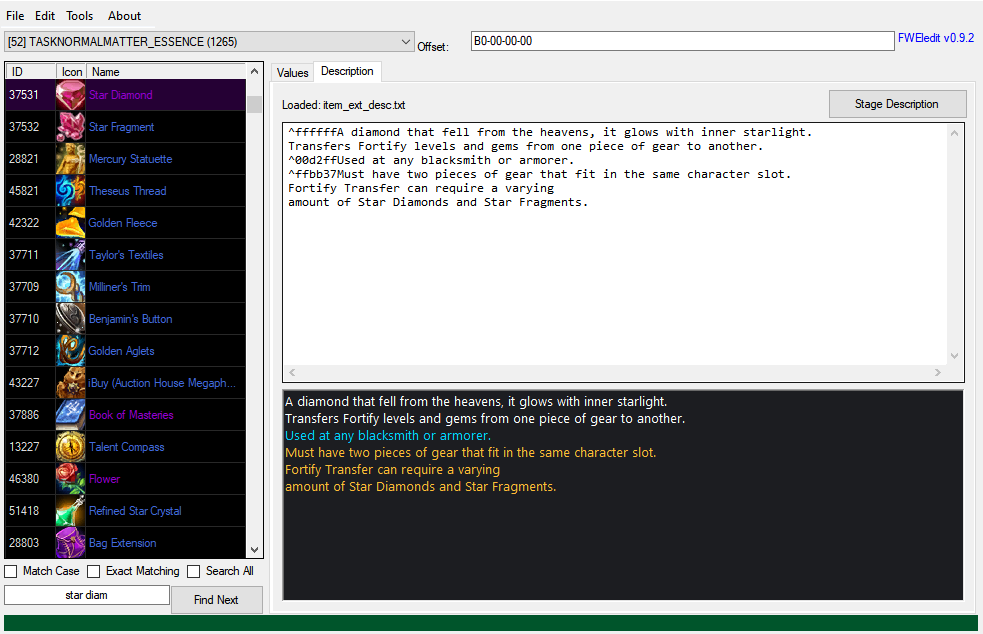
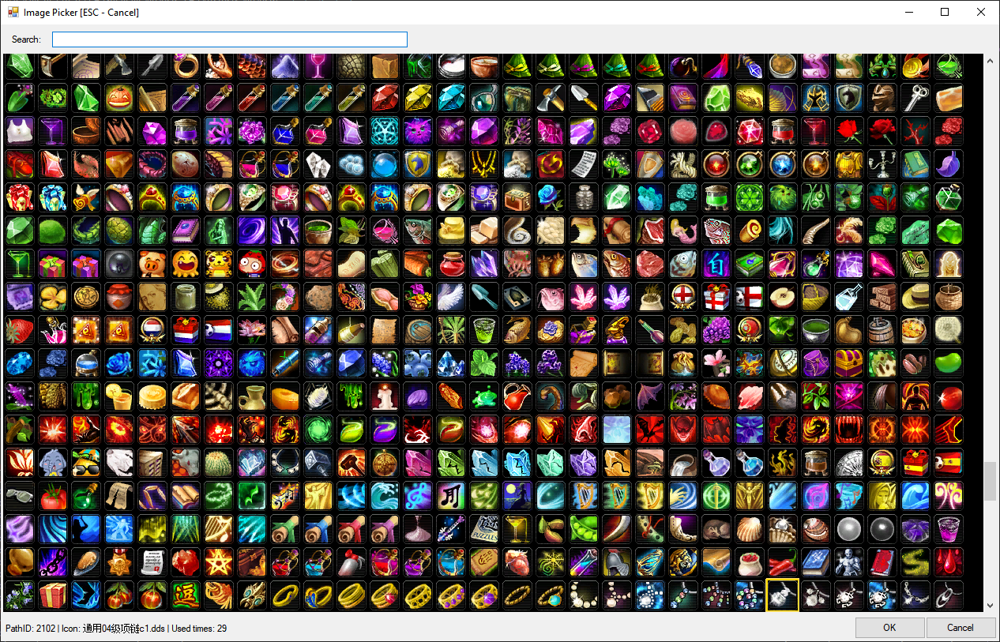
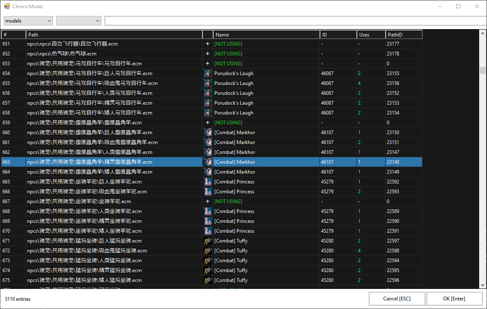
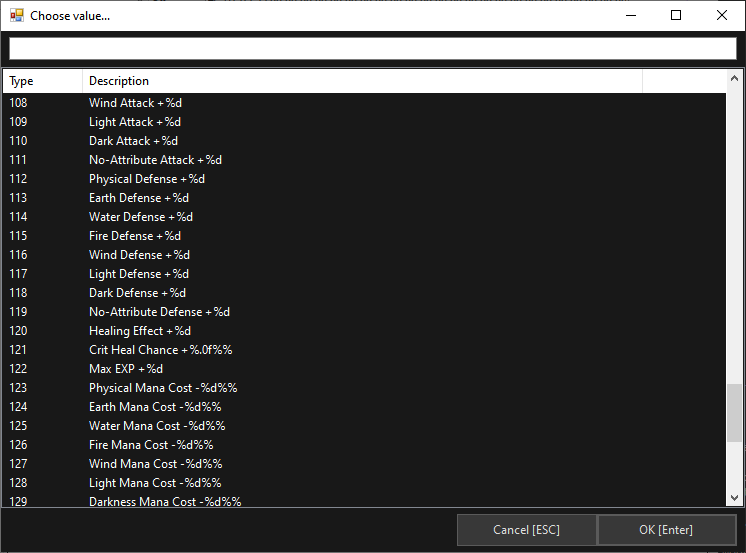
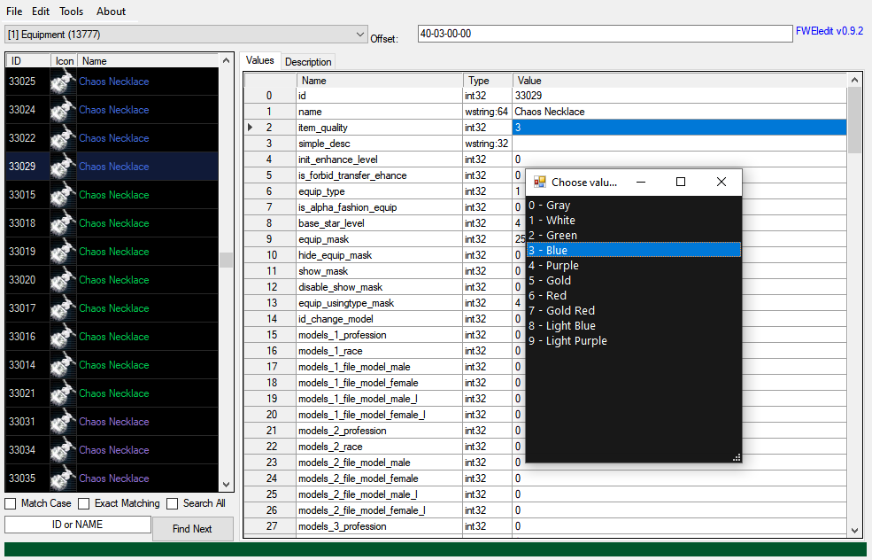

# FWEledit

> A free, open-source `elements.data` editor for **Forsaken World** private servers.

FWEledit lets you browse, edit, and save the binary game data tables that drive items, equipment, NPCs, monsters, skills, descriptions, and more — directly from your game installation folder. It ships with config files covering seven known server versions and handles PCK resource packages automatically.

FWEledit is based on [sELedit++ by Wrechid](https://github.com/Wrechid/sELedit-), which is itself a modified edition of the original **sELedit** from PW-Tools — a Perfect World `elements.data` editor written in C#. FWEledit extends that foundation with Forsaken World-specific data formats, PCK integration, a new icon and model workflow, a description editor, and a range of stability and usability improvements.

> **Why open source?** The Forsaken World private server community has seen free editors disappear over the years simply because their source code was never shared — when the original author moved on, the tool died with them. FWEledit exists to break that cycle. By keeping the source open, any developer can pick it up, fix it, extend it, or fork it. The tool survives as long as the community does.

> **Current development focus:** this release was built and validated against **FW v608** data. Config files for other versions (v547, v595, v610, v773, v834, v849) are included as a starting point, but they have not been thoroughly tested and may require adjustments — both to the `.cfg` field definitions and possibly to the editor's parsing logic — to work correctly with those binaries. Making those versions fully functional is one of the intended goals of opening this project to community contributions.

---

## What's New in v0.9.2

- Full MVVM migration: UI logic and flows moved out of Forms into services/coordinators.
- MainWindow trimmed: navigation, selection, tooltips, description, save, search, and actions split into dedicated services.
- Injectable session: removed static `EditorSession`, everything now uses `SessionService`.
- Secondary windows refactored: `ConfigWindow`, `RulesWindow`, `ReplaceWindow`, `ClassMaskWindow`, `FieldCompare`, `FieldReplaceWindow`, `JoinWindow`, `LoseQuestWindow`, `ReferencesWindow`, `About`, `IconPicker`.
- Cleaner project structure: removed duplicate `.csproj` entries and standardized service/VM organization.

---

## What's New in v0.9.1

- Global search with auto-complete now scans **all lists** (with Enter-to-search).
- Item names and list rows are **quality-colored**, with a black list background for better contrast.
- Corrected `item_quality` color mapping and quick picker list.
- Backup system now creates **dated ZIPs** under `backup_elements`, `backup_configs`, and `backup_path`.
- Build output now always includes required tools (`spck`, `packdll`, `p2sp_4th_lib`, `Pfim`, `7za`) and the `rules` folder.
- App version and settings reset logic updated to avoid stale paths when switching installs.

---

## Table of Contents

- [Features](#features)
- [Requirements](#requirements)
- [Installation](#installation)
- [Getting Started](#getting-started)
- [Interface Overview](#interface-overview)
- [Supported Server Versions](#supported-server-versions)
- [Working with PCK Files](#working-with-pck-files)
- [Editing Data](#editing-data)
  - [Finding Items](#finding-items)
  - [Editing Fields](#editing-fields)
  - [Added Attributes](#added-attributes)
  - [Item Descriptions](#item-descriptions)
  - [Icons](#icons)
  - [Models](#models)
  - [Cloning and Deleting Items](#cloning-and-deleting-items)
- [Saving](#saving)
- [Tools Reference](#tools-reference)
- [Configuration Files](#configuration-files)
- [Localization Files](#localization-files)
- [Session Restore](#session-restore)
- [Error Logging](#error-logging)
- [Project Structure](#project-structure)
- [Building from Source](#building-from-source)
- [Contributing](#contributing)
- [License](#license)

---

## Features

**Core editing**
- Browse all lists (tables) in `elements.data` with a searchable item list and a field-value grid
- Edit any field in place — changes are tracked, highlighted in blue, and validated before write
- Add, clone, and delete items with automatic unique ID generation and duplicate ID protection
- Batch field replacement across multiple items at once
- Cross-reference search: find every item in any list that references a given ID

**Resource integration**
- Game-folder workflow — point to your game root and the editor locates `elements.data` and all resources automatically
- PCK package support — reads model and asset lists directly from `.pck` index tables without requiring full extraction
- Automatic workspace extraction for `configs.pck` and `surfaces.pck` via `spck`
- `path.data` integration for deterministic icon and model path resolution

**Icon picker**
- Visual icon browser populated from the game's `iconlist_ivtr0` DDS atlas
- Thumbnails load progressively in the background; the picker opens immediately
- Search by path ID or filename; hover tooltip shows usage count across the current list
- Single-click to select and apply

**Model chooser**
- Browse `file_model*` and `file_models*` fields with a full Choice Model window
- Enumerates entries directly from PCK index tables (no extraction required)
- Package filter, text search, usage counts, and CSV export
- Displays current path ID and resolved path side by side

**Description editor**
- Dedicated tab for reading and editing `item_ext_desc.txt` per item
- Live preview pane renders FW color tags (`^RRGGBB`) so you see styled output while editing
- Staged save: description changes are held in memory and written together with the main save pipeline
- ID remap: renaming an item's ID automatically migrates its description entry

**Added Attribute display**
- Full FW-specific label mapping for addon types 0–145 (elemental resistances, crit stats, masteries, movement speed, and more)
- Type picker lets you choose addon types from a labeled list instead of typing numeric IDs
- Percentage-based params (`param1`–`param3`) are decoded from packed int to human-readable float and written back correctly on edit
- Translation lookup order: `addon_table_en.txt` → `addon_table_pt.txt` → `addon_table.txt`

**Edit safety**
- Valid changed fields highlighted in blue; invalid entries (duplicate or non-numeric IDs) highlighted in red and blocked from write
- Pre-save duplicate ID validation across every list
- Atomic save pipeline: writes to a temp file, creates/updates `.bak`, then replaces the target — a failed save cannot corrupt your data
- Close confirmation when there are unsaved changes
- Timestamped ZIP backups are created on save (see [Saving](#saving))

**Session restore**
- Remembers last game folder, last selected list, and last selected item ID across restarts
- `File > Load Last Folder` for one-click reopen

---

## Requirements

- **Windows** (the application is a Windows Forms desktop app)
- **.NET Framework 4.5.2** or later (included with Windows 8.1+; downloadable for Windows 7)
- **Bundled tools** — releases include `spck`, `packdll`, `p2sp_4th_lib`, `Pfim`, and `7za` under `tools/` and copy them to the output folder on build.

The editor functions without `spck` for basic data editing, but icon thumbnails and description editing require a successful PCK extraction.

---

## Installation

1. Download the latest release from the [Releases](../../releases) page.
2. Extract the zip to any folder — no installer required.
3. Run `FWEledit.exe`.

---

## Getting Started

1. Launch `FWEledit.exe`.
2. Go to **File > Load...** and select your game's root folder (the folder that contains the `elements` directory or `elements.data` directly). The editor auto-locates `elements.data` and binds all resource lookups to that installation.
3. The left panel populates with all data lists. Select a list from the dropdown at the top, then click any item in the grid below it.
4. The right panel shows the **Values** tab with all fields for the selected item. Click any value cell to edit it.

On the next launch, **File > Load Last Folder** reopens the same game folder immediately. The last selected list and item are also restored automatically.

---

## Interface Overview

```
┌─────────────────────────────────────────────────────────────────┐
│  File   Edit   Tools   About                                    │
├──────────────────┬──────────────────────────────────────────────┤
│  List selector   │  Values  │  Description                      │
│  ───────────     │  ──────────────────────────────────────────  │
│  Search bar      │  Name       │  Type    │  Value              │
│                  │  id         │  int32   │  1234               │
│  ID │ Icon │ Name│  name       │  wstring │  Iron Sword         │
│  ── │ ──── │ ────│  file_icon  │  int32   │  4521  [...]        │
│  1  │  🗡  │ ... │  file_model │  int32   │  8800  [...]        │
│  2  │  🗡  │ ... │  ...        │  ...     │  ...                │
└──────────────────┴──────────────────────────────────────────────┘
```

- **List selector (top-left dropdown):** chooses the active data table (e.g., `Equipment`, `MEDICINE_ESSENCE`, `NPC_ESSENCE`).
- **Item grid (left panel):** shows ID, icon thumbnail, and name for every entry in the selected list. Click a row to load its fields on the right.
- **Values tab (right panel):** shows every field for the selected item as Name / Type / Value rows. Click a value cell to edit it. Changed fields turn blue; invalid entries turn red.
- **Description tab (right panel):** shows the raw description text and a styled color-tag preview. Edit in the top box; the preview updates in real time.
- **Inline picker button (`[...]`):** appears on `file_icon` and `file_model*` rows in the Values grid. Click to open the icon or model chooser for that field.

---

## Screenshots

**Main window**


**Search**


**Item description editor**


**Icon picker**


**Model selector**


**Attribute selector**


**Quality item change**


---

## Supported Server Versions

FWEledit ships with config files for the following Forsaken World server binary versions:

| Config file | Version | Status |
|---|---|---|
| `FW_X.X.X_v547.cfg` | v547 | Untested — community contributions needed |
| `FW_X.X.X_v595.cfg` | v595 | Untested — community contributions needed |
| `FW_X.X.X_v608.cfg` | v608 | **Primary target — actively developed and validated** |
| `FW_X.X.X_v610.cfg` | v610 | Untested — community contributions needed |
| `FW_X.X.X_v773.cfg` | v773 | Untested — community contributions needed |
| `FW_X.X.X_v834.cfg` | v834 | Untested — community contributions needed |
| `FW_X.X.X_v849.cfg` | v849 | Untested — community contributions needed |

The correct config is matched automatically when you load `elements.data`. If no config matches, the editor shows a message and allows you to select or create one manually via **Tools > Config Editor**.

> **Using a version other than v608?** The bundled config files for other versions are provided as a starting point based on known field layouts. You will likely need to verify and adjust the field names, types, and order in the `.cfg` file to match your server's actual binary layout. In some cases, parser-level changes in the editor code may also be needed. See [Configuration Files](#configuration-files) for the config format and [Contributing](#contributing) for how to submit fixes.

---

## Working with PCK Files

FWEledit uses `spck` to extract `configs.pck` and `surfaces.pck` into a per-client temporary workspace under `%LOCALAPPDATA%\FWEledit\workspace\<hash>`. This extraction happens automatically the first time you load a game folder, and only re-runs when the source `.pck` timestamp changes.

Model and asset lists for the **Choice Model** window are read directly from the PCK index tables — no extraction of `models.pck`, `gfx.pck`, or `grasses.pck` is required for browsing.

**On Save**, the editor:
1. Writes `elements.data` atomically (temp → backup → replace).
2. Repacks any modified packages (`configs.pck` if descriptions changed) from workspace back into the game's `resources` folder using `spck -fw -c`.
3. Creates a `.bak` backup of the previous `.pck` before replacing it.

If `spck.exe` is not found, the save still writes `elements.data` correctly; only the PCK repack step is skipped.

---

## Editing Data

### Finding Items

- Type a name or numeric ID into the **search bar** above the item grid and press **Find Next** or Enter.
- Check **Search All** to search across all lists simultaneously.
- Use **Exact Matching** and **Match Case** for precise lookups.
- The search bar shows auto-complete suggestions as you type.

### Editing Fields

1. Select an item in the left grid.
2. Click the **Value** cell for any field in the right grid.
3. Type the new value and press Enter or click away to confirm.

Changed fields are highlighted **blue**. If a value is invalid for its field type (e.g. a non-numeric value in an `int32` field, or a duplicate ID), the cell turns **red** and the value is not written to the data model until corrected.

To apply the same value to multiple selected items at once, select them in the left grid, type a value in the **Set Value** box at the top, and click **Set Value To Selected**.

### Added Attributes

The `EQUIPMENT_ADDON` list (list 0) uses a numeric `type` field to identify stat bonuses. FWEledit decodes these into readable labels automatically in both the item list and the Values grid.

To change an addon type without memorizing IDs, double-click the `type` field value to open the **type picker**. The picker lists all known types with readable labels and opens pre-selected at the current value.

Percentage-based params (`param1`, `param2`, `param3`) for types such as crit chance, elemental resistances, and damage modifiers are displayed as human-readable floats (e.g., `0.05` for 5%). The editor encodes them back to packed int on save automatically.

### Item Descriptions

1. Select any item.
2. Click the **Description** tab in the right panel.
3. Edit the raw text in the upper box. FW color tags (`^RRGGBB...^r`) are supported; the lower preview renders them styled.
4. Click **Stage Description** to stage the change. Description changes are held in memory and flushed to `item_ext_desc.txt` during the next **Save**.

> If you change an item's `id` field, the description entry is automatically remapped from the old ID to the new one.

### Icons

Double-click any `file_icon` or `file_icon1` field value, or click the **`[...]`** button that appears on that row, to open the **Icon Picker**.

The picker loads thumbnails from the game's `iconlist_ivtr0` DDS atlas and populates progressively in the background — the window opens immediately. Hovering over an icon shows its path ID, filename, and how many items in the current list already use it. Click an icon to select and apply its path ID.

### Models

Double-click any `file_model*`, `file_models*`, or `model_name_*` field value to open the **Choice Model** window.

The model list is populated from the PCK index of the selected package (`models`, `gfx`, `grasses`, etc.) and shows path, name, path ID, and usage count. Use the package dropdown and search box to filter. The current model is pre-selected when the window opens.

Select a model and click **OK** (or double-click the row) to write the path ID back to the field. The Values grid displays model fields as `PathID | mapped_path` for readability; only the numeric path ID is stored in `elements.data`.

To export the current model list for external comparison, use the **Export CSV** button inside the Choice Model window.

### Cloning and Deleting Items

Right-click an item in the left grid (or use the **Edit** menu) to access:

- **Clone Selected Items** — creates a deep copy with a new unique ID assigned automatically, appended to the end of the list.
- **Delete Selected Items** — removes the selected item(s) permanently (takes effect on save).
- **Move items to top / to end of list** — reorders selected items within the list.
- **Export Selected Items** / **Replace Selected Item** — export or import item data as JSON for sharing or applying changes across installs.

---

## Saving

| Action | Description |
|---|---|
| **File > Save** | Overwrites `elements.data` in place and repacks any changed PCK files. |
| **File > Save As** | Saves to a chosen path; the editor switches context to that path for future saves. |
| **Stage Description** | Stages description changes in memory without writing any file. Flushed during the next Save. |

**Save pipeline for `elements.data`:**
1. Validates all lists for duplicate or non-numeric `id` field values. Save is blocked if any are found, and a per-list report is shown.
2. Writes to a temp file (`<filename>.tmp_fweledit`).
3. Copies the existing file to `<filename>.bak`.
4. Replaces the target with the temp file.
5. Any error is appended to `logs/fweledit-errors.log`.

A failure at any step does not corrupt the original file.

**Additional backups:** On each save, the editor also writes a dated ZIP backup of:
- `elements.data` to `backup_elements/`
- `configs.pck` (when modified) to `backup_configs/`
- `path.data` (when modified) to `backup_path/`

---

## Tools Reference

| Menu item | Description |
|---|---|
| **Edit > Logic-Replace** | Replace field values using conditional logic rules across a list. |
| **Edit > Field-Replace** | Find and replace a specific value in a specific field across all items in a list. |
| **Edit > Skill Validation Check** | Validates skill references in the data (v1.3.6 servers). |
| **Edit > Skill-Replace** | Batch-replace skill IDs across relevant fields (v1.3.6 servers). |
| **Edit > Tome Validation / Tome-Replace** | Same as above for tome data (v1.3.6 servers). |
| **Edit > Property Validation / Property-Replace** | Validates and replaces property references (v1.3.6 servers). |
| **Edit > Probability Verification** | Checks that drop/probability table entries sum correctly (v1.3.6 servers). |
| **Edit > Task Overflow Check** | Detects task list overflows (v1.4.2+ servers). |
| **Tools > EL Version** | Displays the detected `elements.data` version and structure summary. |
| **Tools > Config Editor** | Opens the config editor to view or modify list structure definitions. |
| **Tools > EL Structure Diff (Rules)** | Compares two `elements.data` files and shows structural differences. |
| **Tools > Field Compare** | Compares field values between two `elements.data` files side by side. |
| **Tools > NPC List Export** | Exports the NPC list to a readable text file. |
| **Tools > Monster → AI Link List** | Exports a mapping of monsters to their AI script entries. |
| **Tools > Join new Elements** | Merges entries from a second `elements.data` into the current one with configurable rules (add new, replace changed, remove missing). |
| **Tools > Class Mask Generator** | Opens a helper to build bitmask values for class restriction fields. |
| **Search xrefs to Item** | (right-click on item) Finds all entries across all lists that reference the selected item's ID. |

---

## Configuration Files

Config files (`configs/*.cfg`) define the field structure of each list in `elements.data` for a given server binary version. The format is plain text:

```
<total list count>
<conversation list index>

<list number> - <LIST_NAME>
<element size in bytes>
<field1;field2;field3;...>
<type1;type2;type3;...>

<list number> - <LIST_NAME>
...
```

Supported field types: `int16`, `int32`, `int64`, `float`, `double`, `string:<n>`, `wstring:<n>`, `byte:<n>`.

To add support for a new server version:
1. Copy the closest existing config file.
2. Adjust field names and types to match your server's binary layout.
3. Name the file `FW_X.X.X_v<version>.cfg` and place it in the `configs/` folder.
4. The editor will pick it up automatically on next load.

Use **Tools > Config Editor** to inspect and modify config files interactively. The config editor can also scan a loaded `elements.data` to estimate list offsets and entry sizes for unknown versions.

---

## Localization Files

FWEledit reads the following optional text files to improve label and tooltip display. Each file is looked up first under the editor's `resources/data/` folder, then under the game root's `data/` folder:

| File | Purpose |
|---|---|
| `language_en.txt` | English strings for skill names, stat labels, and item property tooltips |
| `buff_str.txt` | Buff/debuff name strings |
| `skillstr.txt` | Skill name strings used in Added Attribute display |
| `item_ext_desc.txt` | Item extended descriptions (read from extracted `configs.pck`) |
| `addon_table_en.txt` | English labels for Added Attribute type IDs |
| `addon_table_pt.txt` | Portuguese labels for Added Attribute type IDs (fallback) |
| `addon_table.txt` | Default labels for Added Attribute type IDs (last resort) |

None of these files are required. Missing files are silently skipped and the editor starts normally without them.

---

## Session Restore

FWEledit persists the following settings between sessions:

| Setting | Description |
|---|---|
| `LastGameFolder` | Last successfully loaded game root path |
| `LastListIndex` | List that was active when the editor was closed |
| `LastItemId` | Item ID that was selected when the editor was closed |

On startup, if a previous game folder is found in settings, the editor loads it automatically and restores the last list and item. This can be bypassed at any time by choosing **File > Load...** to switch to a different folder.

---

## Error Logging

Save errors and unexpected exceptions are written to:

```
logs/fweledit-errors.log
```

This file is located in a `logs/` folder next to `FWEledit.exe`. Each entry includes the operation context, exception type, message, and stack trace. The file is appended on each run and is not rotated automatically — delete or archive it manually if it grows large.

When reporting a bug, including the relevant portion of this file is very helpful.

---

## Project Structure

```
FWEledit/
├── FWEledit.sln
└── FWEledit/
    ├── MainWindow.cs              # Main window — UI, navigation, edit state, search
    ├── AssetManager.cs            # PCK extraction, icon/model/path resolution
    ├── ConfigWindow.cs            # Config editor window
    ├── IconPickerWindow.cs        # Visual icon picker window
    ├── FieldReplaceWindow.cs      # Field-Replace tool window
    ├── RulesWindow.cs             # EL Structure Diff (Rules) window
    ├── FieldCompare.cs            # Field Compare window
    ├── JoinWindow.cs              # Join new Elements window
    ├── ClassMaskWindow.cs         # Class Mask Generator window
    ├── LoseQuestWindow.cs         # Lost quest helper window
    ├── ReplaceWindow.cs           # Logic-Replace window
    ├── ReferencesWindow.cs        # Cross-reference results window
    ├── DDSReader/                 # DDS texture decoder (DXT1, DXT3, DXT5)
    ├── COMMON/
    │   ├── eList.cs               # Single list (table): fields, types, values, get/set
    │   ├── eListCollection.cs     # Loads and saves elements.data binary; holds all lists
    │   ├── eListConversation.cs   # Conversation list model
    │   ├── CacheSave.cs           # Runtime cache: icon bitmaps, themes, path maps
    │   ├── Extensions.cs          # Item property helpers, localization, color-tag parser
    │   └── GetProps/              # Per-list tooltip renderers (one file per list type)
    ├── configs/                   # FW version config files (v547–v849)
    ├── Resources/                 # Embedded images (placeholder icons, loading animation)
    └── OOP_NET/
        └── oops/
            └── Newtonsoft.Json/   # JSON serializer (included as source)
```

---

## Building from Source

**Prerequisites:**
- Visual Studio 2017 or later (Community edition is free)
- .NET Framework 4.5.2 targeting pack

**Steps:**

```bash
git clone https://github.com/<your-org>/FWEledit.git
```

1. Open `FWEledit.sln` in Visual Studio.
2. Build → Build Solution (`Ctrl+Shift+B`).
3. Output is written to `FWEledit/bin/Debug/` (or `Release/` for release builds).

The `configs/` and `rules/` folders are copied to the output directory automatically by the build rules, along with required tools under `tools/` (`spck`, `packdll`, `p2sp_4th_lib`, `Pfim`, `7za`). No NuGet packages are required ? `Newtonsoft.Json` is included as source and `Ionic.Zlib` as a compiled DLL, both inside the repository.

---

## Contributing

Contributions are welcome. A few ground rules:

- **Open an issue first** for any non-trivial change — new features, behavior changes, new config versions — so it can be discussed before you invest time coding.
- **One pull request per concern.** Keep changes focused and easy to review.
- **Do not break v608.** It is the validated baseline. If your change affects binary read/write logic or field parsing, confirm that v608 still loads and saves correctly.
- **Document new or fixed config versions.** If you add or correct a `.cfg` for any version, describe in the PR which server build you tested against, what fields you changed, and how you validated the result (e.g. items load without errors, specific fields match expected values).
- **Append to the changelog.** Add a plain-English entry to `CHANGELOG.md` describing what changed, why, and what the observable impact is.

**Helping with other server versions** is one of the primary goals of this open-source release. If you run a v547, v610, v773, v834, or v849 server and want to get FWEledit working for your version, here is where to start:

1. Load your `elements.data` — the editor will attempt to match a config automatically.
2. If lists load with wrong field counts or garbled values, open **Tools > Config Editor** and use the scanner to estimate the correct entry sizes.
3. Compare the field layout in the `.cfg` against your server's source or a known-good reference.
4. Correct field names, types, and order as needed.
5. If the editor crashes or produces wrong output even with a corrected `.cfg`, open an issue with your findings — it may indicate a parser-level fix is needed in the code.

For bug reports, please include:
- The server version (visible in the title bar or under **Tools > EL Version**).
- The config file in use.
- The contents of `logs/fweledit-errors.log` if a crash or save failure occurred.

---

## Acknowledgements

FWEledit stands on the work of others. Credit where it is due:

- **[Wrechid/sELedit++](https://github.com/Wrechid/sELedit-)** — the direct upstream this project is forked from. sELedit++ adapted the original PW-Tools editor for a broader set of server versions and is the codebase FWEledit was built on top of.
- **sELedit (PW-Tools)** — the original open-source Perfect World `elements.data` editor in C# that established the core binary read/write model, the config file format, and the list/field data structure still used in FWEledit today.
- **[Newtonsoft.Json](https://www.newtonsoft.com/json)** — JSON serialization library included as source under the MIT license.
- **[Ionic.Zlib](https://github.com/DinoChiesa/DotNetZip)** — zlib/deflate implementation used for PCK index decompression, included as a compiled library.
- **DDSReader** — DDS texture decoder (DXT1, DXT3, DXT5) included as source for loading icon atlas files.

---

## License

This project is released under the [FWEledit License](LICENSE) — a custom license that permits free use for any purpose. Commercial use is allowed provided that a free tier of the product remains publicly available.

> FWEledit is an independent community tool. It is not affiliated with, endorsed by, or connected to the original Forsaken World game, its publishers, or any official software distribution.
